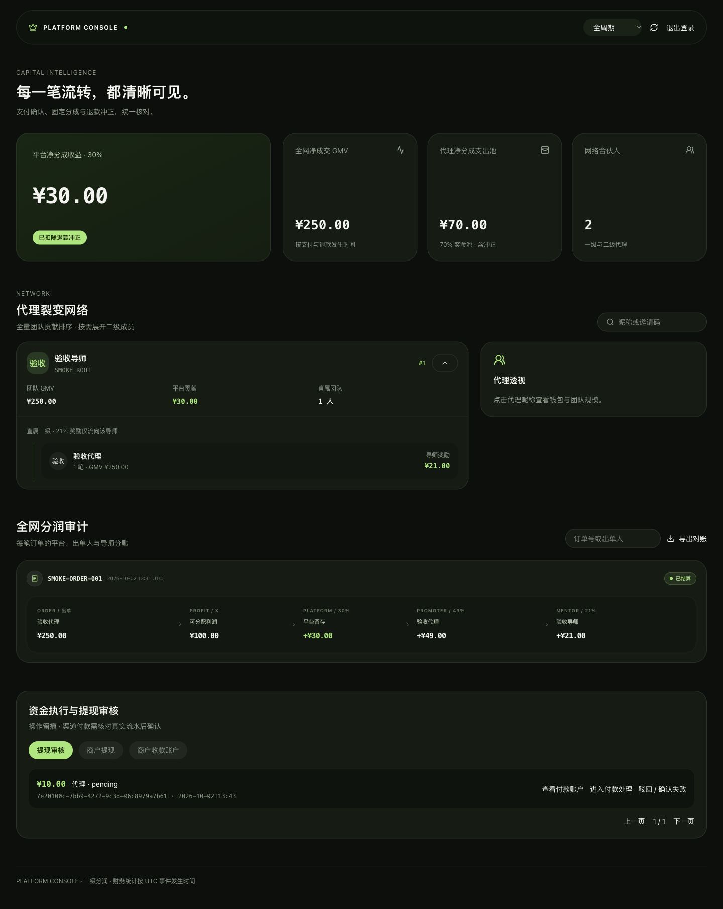
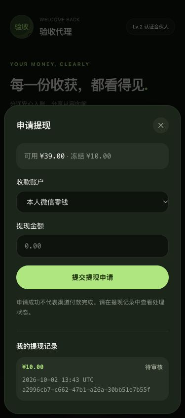

# 审查整改与升级记录 · 2026-10-03

本次按审查报告修改了实际源码、SQL 迁移、正式网页、两套原生小程序基础工程、构建与测试。没有修改正式数据库，没有连接真实商户，也没有发布线上网站。

## 已完成的整改

### 资金与身份（原 P1）

1. **资金入口接通到事务服务。** 管理员订单创建、商户网关签名事件、支付幂等、分润、全额退款冲正、提现冻结/确认/失败恢复均有 API。平台和代理的钱包变动新增不可修改账本，同事务记录原因和业务单号。缺少钱包、金额不符或中途失败会整体回滚，事件不会被错误确认成功。
2. **历史受益人固定。** 新订单在创建时锁定直属上级及规则版本；结算使用快照，不再读取当时的 parent_id。旧已结算单以原日志恢复受益人。只有平台、出单人和其直接上级参与分配，任何第三层绑定均拒绝。
3. **退款与已付出佣金有处理路径。** 原分润流水保留，单独记录冲正。余额不足形成待追偿余额，后续收入和解冻先抵扣；不会静默改出负钱包或把已提现佣金当作已经追回。
4. **登录不再依赖未交付服务。** 新增管理员密码登录、管理员独立微信登录、代理和老板的单次网页登录桥接、HttpOnly Cookie。角色及 token_version 每次回查；退出、改密码和停用撤销会话。代理过期请求单次续登，老板密码登录过期需重新输入密码。
5. **真实浏览器检查补出并修复 BFF 域名错误。** 同源校验基于请求 Host 或显式 WEB_ORIGIN，避免 Next 内部 localhost 与浏览器 127.0.0.1 不一致导致误拒绝。HTTPS Cookie 依据已校验的公开 Origin 设置 Secure；切换身份清除另一角色 Cookie。跨站 Origin 仍被拒绝。
6. **旧 PostgreSQL URL 显式适配。** schema、SSL、连接池及连接超时参数在引擎创建前转换；未知/非法配置启动时报错，不继续把 Prisma 参数传给 asyncpg。
7. **构建不再依赖已有生成文件。** 类型检查和旧测试自动生成 Prisma 客户端，生成操作有独立占位连接串且不连接数据库；部署迁移仍必须使用真实配置。
8. **扫码生命周期修复。** 注册与首绑同事务；冷启动等待绑定，热启动扫码排队处理；续登期间的新邀请不会被吞掉。首绑失败回滚新注册身份，页面有重试；二级代理不能通过邀请或太阳码再发展第三层。

### 数据、规模与交付（原 P2）

9. **分页完整。** 代理流水、直属团队及老板网络/审计支持继续翻页；旧筛选响应不能覆盖新筛选，第 101 条记录有专门回归测试。Web 加载失败显示错误及重试，不再伪装成空列表或零资产。
10. **报表统一事件时间。** UTC、左闭右开时间段；GMV 按支付减退款，收益按入账减冲正。今日预计包含今日净入账和今日付款待结算，不会结算后归零；跨月退款不重写前月收益，当前期可为负。新增 /api/agent/activity 展示发生期的正佣金和负退款，原 /api/agent/ledger 不改变结构。
11. **汇总和排行在服务端。** 代理月度分成与贡献前四名按全量计算；管理员网络分页，展开时加载二级节点，团队净贡献排行与总览口径一致。旧完整树保留契约但不再被正式 UI 周期性下载。
12. **CSV 一致快照导出。** PostgreSQL REPEATABLE READ、服务器游标、流式响应；并发新订单不会使导出分页边界漂移。导出明确区分原始分成与退款状态，并转义电子表格公式前缀。月度审计纳入当月发生退款的历史单，CSV 新增当期净额列。
13. **接口错误和契约补齐。** 微信拒绝/网络失败、参数验证、数据库冲突和未处理异常均为 JSON。旧请求校验维持 400；公开 OpenAPI 同步该行为。提交生成的请求/响应 TypeScript 类型及完整 OpenAPI，并在 CI 校验。
14. **展示站可由根仓库重建。** 新增包含独立锁文件的 showcase-template。准备脚本生成展示入口；同步支持嵌套目录、资源、删除和遗留文件检查，保留既有托管身份和路由。干净副本验证实际发现锁文件缺失，已补上。
15. **原生双端基础工程与网页对齐。** 代理四 Tab 深色页、独立团队/海报/提现页；老板三 Tab 深色页、独立微信 AppID、预关联管理员身份、单次登录码 web-view 桥接。配置脚本只写 AppID 和域名，商户密钥只在后端。

### 维护与体验（原 P3）

- 业务写入收敛到 commission / payments / wallets / withdrawals 服务，路由承担权限和参数，数据库统计独立 queries 模块；保留模块化单体。
- 格式化 React、原生 JavaScript 和工具代码；启用 Python Ruff 与 Web 未使用符号检查。
- 弹层补焦点限制、Escape、焦点恢复、滚动边界和按钮焦点指示；资金界面显示冻结、追偿与实际处理状态。
- 网页补收款身份关联、银行保管凭据核验、提现历史和老板审核；付款账户明细仅管理员可访问。
- 健康检查、请求关联 ID、无敏感请求体日志、对账与结算恢复命令已交付。监控平台和共享边缘限流需要在部署环境接入。
- 默认启动仅 Python；旧 TypeScript 代码与测试作为对照保留，start:legacy 明确拒绝启动。

## 数据升级及历史边界

新增迁移：`prisma/migrations/20261003000000_financial_lifecycle/migration.sql`，整体事务执行。新增字段和资金表，不删除旧四张核心表，也不修改旧 API 的成功响应字段结构。

上线前按顺序操作：

1. 备份目标数据库并在副本演练迁移。暂停旧 Node 进程及所有旧余额写入，保证切换窗口只有一个资金服务负责写入。
2. 配置 root DATABASE_URL，运行 `pnpm db:deploy`；再更新 Python / Web 与两个原生工程。
3. 安全创建管理员、配置域名与微信 AppID；生产 Web 设置 WEB_ORIGIN 和 HTTPS，配置反向代理请求体限制及共享身份限流。
4. 运行对账命令，处理所有差异和历史退款；用所选商户渠道的测试单验证支付、重复通知、退款、提现失败及对账。
5. 验证渠道账户和账面余额相符后才开放真实提现。

历史时间不足时不能凭空恢复：旧 PAID/REFUNDED 单 paid_at 暂用创建时间，settled_at 用已有平台流水时间；旧 refunded_at 没有补造。旧未结算订单在切换时固定当前直属上级；无法还原未保存的创建时关系。attribution_locked_at 如实记录迁移时刻。旧已退款但无新退款记录的订单会被对账标记，并拒绝假装已经走过新冲正流程。

迁移把原钱包数值记为 opening 流水；平台初始账面余额以历史平台分润总和建立。**它不是商户银行余额，也不能判断历史上是否曾线下提现。** 开放真实付款前必须核对历史外部付款、退款、冻结和期初余额；不会自动覆盖已有钱包或猜测历史资金去向。历史统计口径调整是有意的业务修正，接口字段名称保持兼容。

## 仍需要真实接入的条件

- **支付渠道尚未选定。** 已实现的是可信商户网关 HMAC 契约；网关必须先验证支付提供方原生签名和商户/订单/金额。不能把微信支付 v3 原始回调直接发到该接口。目前仅全额支付和全额退款；部分退款及向渠道发起退款需进一步接入。
- **付款执行为人工渠道付款后确认。** API 冻结资金、记录成功或失败凭据并保持账目原子性，没有自动向银行/微信发送转账。渠道状态未知不能解冻；用提现单号作为外部渠道幂等业务单号。银行 vault_ 标识需来自实际保管服务；代理 UI 不要求用户填写内部保管凭据，尚未接入付款服务时说明银行收款未开通；现阶段拒绝直接换绑既有账户，换卡审核流程尚未提供。
- **微信真机待验收。** 两个真实 AppID、合法 request 域名、老板 web-view 业务域名和管理员 open_id 关联需要配置。原生 JS 生命周期模拟不能证明微信扫码、太阳码、保存相册及后台恢复已在真实设备通过。
- **生产迁移、远程 CI、压测和线上发布未执行。** 本次完成了本地独立依赖安装、构建与隔离数据库测试。大规模导出可进一步后台任务化；目前未增加多租户或微服务，业务没有确认这些需求。

## 验证记录

- PostgreSQL 16 隔离容器：后端 **62 项通过，0 跳过**。包括直推/两级精确金额、并发入账一次、完整事务回滚、退款后追偿、冻结失败恢复、快照稳定、跨月净统计和活动冲正、旧库有数据迁移、101 人全量排行、稳定 CSV、权限和单次登录码。
- TypeScript 对照测试 **20 项通过**；小程序生命周期、分页、展示同步、BFF 同源校验工具测试 **9 项通过**。
- 正式 Web 类型检查及生产构建通过；展示站静态生产构建通过；Ruff、格式及生成契约检查通过。
- 临时干净源码副本从锁文件独立安装依赖，缺少 generated/prisma 的情况下自动生成并通过类型检查、旧测试、正式 Web 构建；由模板新建的展示站安装与构建通过。
- 本地浏览器用隔离测试账户验证：老板密码登录、全网 30% / 49% / 21% 审计、二级展开；代理单次码登录、收款身份关联、提现申请后可用 49 → 39 与冻结 0 → 10、余额刷新与待审核历史记录。金额和身份均为人工测试数据，没有渠道转账。
- 手机 375px 与 430px 的实际内容宽度均无横向溢出。正式微信设备验证待配置。PC 在实际内容宽度 1440px 验证二级展开与全网分账，无横向溢出。

验收截图使用隔离测试数据库，不能作为真实商户已上线的证明。

## 下一步验收入口

后端启动、签名规则、身份及运维命令见 `python_backend/README.md`；完整 API 见 `docs/api/openapi.generated.json`。代码整改可进入部署演练，真实资金运营仍须完成以上外部接入和历史对账。
