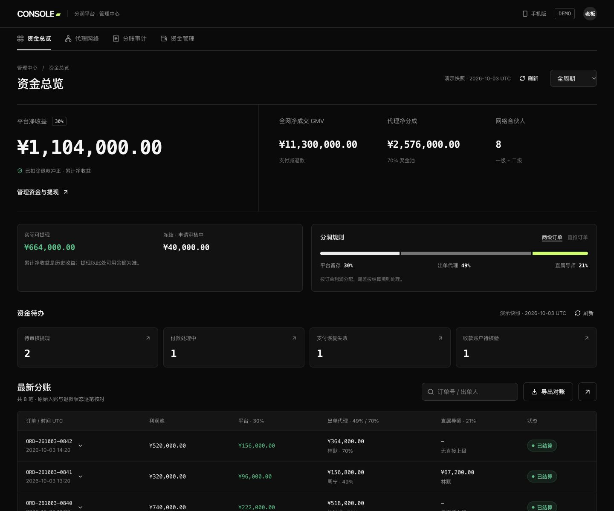
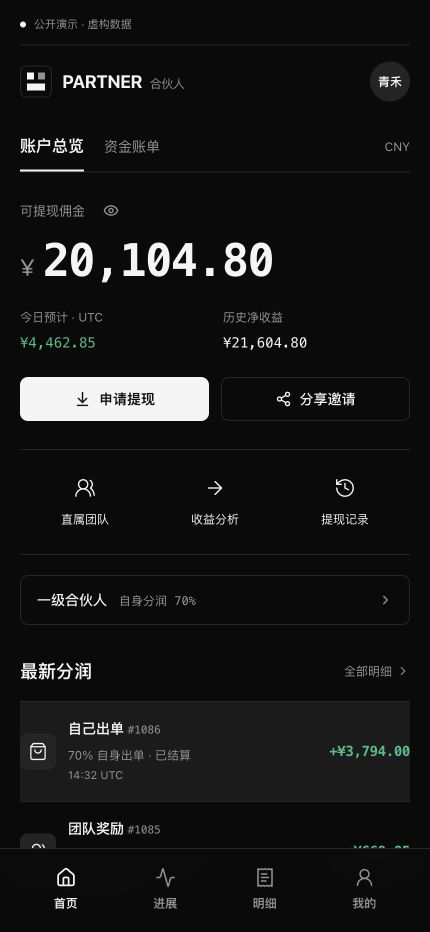

# 交易平台风格 UI 改造

日期：2026-10-04。

## 设计依据

参考 [OKX 官方交易界面](https://www.okx.com/trade-spot/btc-usdt) 的中性暗色空间、紧凑数字分区和明确操作层级。使用本项目 CONSOLE / PARTNER 标识；页面仍服务二级分润，没有增加虚构行情或交易功能。

- 背景 `#0A0A0A`，容器 `#121212`，灰色细分隔线。
- 白色主按钮，黑色文字；正向金额绿色 `#20BF83`，退款红色 `#F36673`。
- 减少渐变、大圆角与装饰卡片；金额使用等宽数字，长金额可换行。
- 代理端保留首页 / 进展 / 明细 / 我的四个路由；老板 PC 提供资金总览 / 代理网络 / 分账审计 / 资金管理四个工作区。
- 保留浅色主题、金额显隐、载入/错误状态、焦点管理和减少动画偏好。

## 主要文件

- `web/app/globals.css`、`web/app/agent/agent-theme.css`：语义颜色、按钮、导航与金额基础样式。
- `web/components/agent-home.tsx`、`agent-ui.tsx`：资产总览、快捷操作、近期分润和共享流水行。
- `web/components/admin-dashboard.tsx`、`admin-audit-table.tsx`：桌面工作区、资金指标和可展开审计。
- `web/components/admin-mobile-home.tsx`、`admin-network.tsx`：老板移动资产页及团队详情。
- `web/components/payout-verification.tsx`：页面内核验表单。
- `web/lib/auth-proxy.ts`：上游异常时也完成当前浏览器退出。
- `miniprogram/services/privacy.js`：原生代理小程序跨页面金额隐私偏好。
- `miniprogram/`、`admin_miniprogram/`：中性暗色与状态色同步；仍需微信开发者工具及真机视觉验收。

## 当前预览

- [老板电脑端](http://127.0.0.1:3017/admin/pc/)
- [代理商手机端](http://127.0.0.1:3017/agent/)
- [老板手机端](http://127.0.0.1:3017/admin/mobile/)

以上是当前电脑的本地展示服务，采用虚构数据，不提交付款。本轮没有发布到既有公网展示域名。

## 截图

## 验证

后端 79、旧 TS 对照 20、前端工具/原生模拟 27 项测试通过；真实 BFF 集成通过。Web 与展示版构建、格式、类型、API 契约与共享文件同步通过。浏览器覆盖 375px / 430px / 1280px / 1440px；原生小程序只进行了代码与模拟测试，未宣称真机验收。

完整发现、修复与尚未完成的事项见[第三轮审查](../reviews/2026-10-04-third-review.md)。
